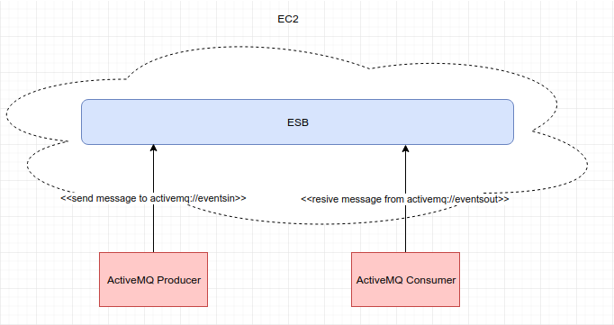

# Simple ESB

## Description

 Simple example ESB
 
### Evidence

## Description

 
 
 We send the messages from a local producer to the bus that is in EC2, the bus redirects the message to another queue, which the local consumer is listening to, which receives the original message from the bus.

**[Video](esb.mp4)**
 
 
### Built with

 * [Java](https://www.java.com) - programming language
 * [Git](https://git-scm.com) - distributed version-control system for tracking changes in source code
 * [Maven](https://maven.apache.org) - project management and build automation tool

## Author

 * **[Sergio Rodríguez](https://github.com/SergioRt1)**
 
## License

This project is licensed under the Apache-2.0 License - see the [LICENSE](LICENSE) file for details